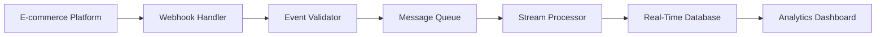

# Data & Analytics Framework for SME Fulfillment Platform
## Comprehensive Data Strategy for Flow.space Alternative

---

## Executive Summary

This document outlines a comprehensive data and analytics framework designed specifically for our SME-focused fulfillment platform. The framework leverages modern data architecture principles while maintaining the simplicity and transparency that differentiate us from enterprise-focused competitors like Flow.space.

Our data strategy focuses on providing actionable insights to SME customers while building enterprise-grade analytics capabilities that support our core value propositions of operational excellence and transparent pricing.

---

## 1. Data Collection Strategy

### 1.1 Data Taxonomy and Classification

#### 1.1.1 Core Business Entities

**Order Management Data:**
```yaml
Orders:
  - order_id: Primary identifier
  - customer_id: Customer reference
  - platform_source: Shopify, Amazon, eBay, etc.
  - order_status: pending, processing, shipped, delivered, returned
  - order_value: Total monetary value
  - order_items: Array of products and quantities
  - shipping_address: Delivery location
  - created_at: Order timestamp
  - updated_at: Status change timestamp
  - fulfillment_time: Time from order to shipment
  - cost_breakdown: Itemized fulfillment costs

OrderItems:
  - item_id: Product identifier
  - sku: Stock keeping unit
  - product_name: Product description
  - quantity: Number of units
  - unit_price: Price per unit
  - weight: Physical weight
  - dimensions: Length, width, height
  - category: Product classification
  - vendor: Supplier information
```

**Inventory Management Data:**
```yaml
Inventory:
  - sku: Stock keeping unit
  - product_name: Product description
  - current_stock: Available quantity
  - reserved_stock: Allocated but not shipped
  - reorder_point: Minimum stock level
  - reorder_quantity: Suggested reorder amount
  - last_restock_date: Recent inventory receipt
  - turnover_rate: Inventory velocity
  - storage_location: Warehouse location
  - storage_cost: Monthly storage fees
  - product_category: Classification
  - seasonal_factor: Demand seasonality indicator

InventoryMovements:
  - movement_id: Unique identifier
  - sku: Product identifier
  - movement_type: in, out, adjustment, transfer
  - quantity: Number of units
  - timestamp: Movement date/time
  - source: Origin location or supplier
  - destination: Target location or customer
  - reason: Movement justification
  - cost_impact: Financial effect
```

**Customer Data:**
```yaml
Customers:
  - customer_id: Primary identifier
  - business_name: Company name
  - contact_email: Primary email
  - phone: Contact number
  - subscription_tier: freemium, growth, scale, enterprise
  - monthly_order_volume: Average orders per month
  - monthly_revenue: Revenue generated
  - signup_date: Account creation
  - last_order_date: Most recent order
  - lifetime_value: Total revenue contribution
  - churn_risk_score: Probability of cancellation
  - satisfaction_score: Customer satisfaction rating
  - integration_platforms: Connected e-commerce platforms
```

**Performance Metrics:**
```yaml
FulfillmentMetrics:
  - metric_id: Unique identifier
  - customer_id: Business reference
  - date: Measurement date
  - orders_processed: Daily order count
  - average_fulfillment_time: Hours from order to ship
  - accuracy_rate: Percentage of error-free orders
  - on_time_delivery_rate: Percentage delivered on time
  - return_rate: Percentage of returned orders
  - cost_per_order: Average fulfillment cost
  - shipping_cost_accuracy: Predicted vs actual shipping costs
  - customer_satisfaction: Survey scores
```

#### 1.1.2 Data Quality Standards

**Data Validation Rules:**
- **Completeness**: All required fields must be populated
- **Accuracy**: Data must match source system values
- **Consistency**: Data formats must be standardized
- **Timeliness**: Data must be updated within defined SLAs
- **Uniqueness**: No duplicate records allowed

**Data Cleansing Procedures:**
```python
# Example data validation service
class DataValidationService:
    def validate_order_data(self, order_data):
        validation_rules = {
            'order_id': self.validate_unique_id,
            'customer_id': self.validate_customer_exists,
            'order_value': self.validate_positive_decimal,
            'created_at': self.validate_timestamp,
            'order_items': self.validate_order_items_array
        }
        
        errors = []
        for field, validator in validation_rules.items():
            if not validator(order_data.get(field)):
                errors.append(f"Invalid {field}: {order_data.get(field)}")
        
        return len(errors) == 0, errors
```

### 1.2 Real-Time vs Batch Data Collection

#### 1.2.1 Real-Time Data Streams

**Critical Real-Time Events:**
- Order creation and status updates
- Inventory level changes
- Payment processing events
- Shipping carrier updates
- Customer support interactions
- System performance metrics

**Real-Time Data Pipeline:**


**Implementation with Kafka:**
```python
# Real-time event processing
class OrderEventProcessor:
    def __init__(self, kafka_consumer, analytics_service):
        self.consumer = kafka_consumer
        self.analytics = analytics_service
    
    def process_order_events(self):
        for message in self.consumer:
            event = json.loads(message.value)
            
            if event['type'] == 'order_created':
                self.analytics.track_order_creation(event)
            elif event['type'] == 'order_shipped':
                self.analytics.track_fulfillment_completion(event)
            elif event['type'] == 'inventory_updated':
                self.analytics.update_inventory_metrics(event)
```

#### 1.2.2 Batch Processing Operations

**Daily Batch Operations:**
- Customer satisfaction surveys
- Inventory optimization recommendations
- Cost analysis reports
- Performance benchmarking
- Predictive analytics model updates

**Weekly Batch Operations:**
- Customer churn analysis
- Revenue forecasting
- Inventory turnover analysis
- Supplier performance evaluation
- Market trend analysis

**Monthly Batch Operations:**
- Customer lifetime value calculation
- Profitability analysis by customer
- Inventory carrying cost analysis
- Competitive benchmarking
- Strategic planning metrics

### 1.3 Platform Integration Data Collection

#### 1.3.1 E-commerce Platform Data Mapping

**Shopify Integration:**
```python
class ShopifyDataCollector:
    def __init__(self, shopify_client):
        self.client = shopify_client
    
    def collect_order_data(self, since_date):
        orders = self.client.get_orders(created_at_min=since_date)
        
        for order in orders:
            standardized_order = {
                'platform_order_id': order['id'],
                'customer_email': order['customer']['email'],
                'order_value': float(order['total_price']),
                'currency': order['currency'],
                'line_items': self.transform_line_items(order['line_items']),
                'shipping_address': self.transform_address(order['shipping_address']),
                'created_at': order['created_at'],
                'fulfillment_status': order['fulfillment_status']
            }
            
            yield standardized_order
```

**Amazon Integration:**
```python
class AmazonDataCollector:
    def __init__(self, amazon_client):
        self.client = amazon_client
    
    def collect_order_data(self, since_date):
        orders = self.client.list_orders(created_after=since_date)
        
        for order in orders:
            order_items = self.client.list_order_items(order['AmazonOrderId'])
            
            standardized_order = {
                'platform_order_id': order['AmazonOrderId'],
                'customer_email': order['BuyerEmail'],
                'order_value': float(order['OrderTotal']['Amount']),
                'currency': order['OrderTotal']['CurrencyCode'],
                'line_items': self.transform_amazon_items(order_items),
                'shipping_address': self.transform_amazon_address(order['ShippingAddress']),
                'created_at': order['PurchaseDate'],
                'fulfillment_status': order['OrderStatus']
            }
            
            yield standardized_order
```

#### 1.3.2 3PL Partner Data Integration

**Warehouse Management System Integration:**
```python
class WarehouseDataCollector:
    def collect_fulfillment_data(self, date_range):
        return {
            'pick_times': self.get_pick_performance(date_range),
            'pack_times': self.get_pack_performance(date_range),
            'shipping_times': self.get_shipping_performance(date_range),
            'accuracy_metrics': self.get_accuracy_metrics(date_range),
            'labor_costs': self.get_labor_costs(date_range),
            'equipment_utilization': self.get_equipment_metrics(date_range)
        }
```

### 1.4 Data Privacy and Compliance

#### 1.4.1 GDPR Compliance Framework

**Data Subject Rights Implementation:**
```python
class GDPRComplianceService:
    def __init__(self, data_repository):
        self.repository = data_repository
    
    def handle_data_subject_request(self, request_type, customer_id):
        if request_type == 'access':
            return self.export_customer_data(customer_id)
        elif request_type == 'rectification':
            return self.update_customer_data(customer_id)
        elif request_type == 'erasure':
            return self.delete_customer_data(customer_id)
        elif request_type == 'portability':
            return self.export_portable_data(customer_id)
    
    def anonymize_customer_data(self, customer_id):
        # Replace PII with anonymized identifiers
        anonymized_data = {
            'customer_id': self.generate_anonymous_id(),
            'email': 'anonymized@example.com',
            'phone': '***-***-****',
            'business_name': 'Anonymized Business',
            'address': 'Anonymized Address'
        }
        
        return self.repository.update_customer(customer_id, anonymized_data)
```

**Data Retention Policies:**
```yaml
DataRetentionPolicy:
  CustomerData:
    retention_period: 7_years
    deletion_after_churn: 2_years
    anonymization_after: 1_year
    
  OrderData:
    retention_period: 7_years
    aggregation_after: 3_years
    detailed_data_retention: 2_years
    
  AnalyticsData:
    retention_period: 5_years
    aggregated_metrics: permanent
    individual_records: 3_years
    
  LogData:
    retention_period: 1_year
    security_logs: 2_years
    audit_logs: 7_years
```

#### 1.4.2 CCPA Compliance

**California Consumer Privacy Act Requirements:**
- Right to know about personal information collection
- Right to delete personal information
- Right to opt-out of sale of personal information
- Right to non-discrimination for exercising CCPA rights

```python
class CCPAComplianceService:
    def handle_ccpa_request(self, request_type, consumer_id):
        if request_type == 'know_categories':
            return self.get_data_categories(consumer_id)
        elif request_type == 'know_specific':
            return self.get_specific_data(consumer_id)
        elif request_type == 'delete':
            return self.delete_consumer_data(consumer_id)
        elif request_type == 'opt_out':
            return self.opt_out_data_sale(consumer_id)
```

---

## 2. Analytics and Business Intelligence Framework

### 2.1 Real-Time Operational Dashboards

#### 2.1.1 SME Customer Dashboard

**Key Performance Indicators:**
```yaml
OperationalMetrics:
  OrdersToday:
    value: 127
    change: +15%
    trend: upward
    
  AverageFulfillmentTime:
    value: 4.2_hours
    target: 4.0_hours
    status: warning
    
  OrderAccuracy:
    value: 99.6%
    target: 99.5%
    status: good
    
  ShippingCostVariance:
    value: -2.3%
    target: 0%
    status: good
    
  InventoryTurnover:
    value: 12.3x
    industry_average: 8.5x
    status: excellent
```

**Real-Time Dashboard Components:**
```typescript
// React component for real-time dashboard
interface DashboardMetrics {
  ordersToday: number;
  fulfillmentTime: number;
  accuracyRate: number;
  costVariance: number;
  inventoryTurnover: number;
}

const OperationalDashboard: React.FC = () => {
  const [metrics, setMetrics] = useState<DashboardMetrics>();
  
  useEffect(() => {
    // WebSocket connection for real-time updates
    const ws = new WebSocket('wss://api.warehouse.space/dashboard');
    
    ws.onmessage = (event) => {
      const data = JSON.parse(event.data);
      setMetrics(data);
    };
    
    return () => ws.close();
  }, []);
  
  return (
    <div className="dashboard-grid">
      <MetricCard 
        title="Orders Today" 
        value={metrics?.ordersToday} 
        trend="up" 
      />
      <MetricCard 
        title="Fulfillment Time" 
        value={`${metrics?.fulfillmentTime}h`} 
        target="4.0h" 
      />
      <MetricCard 
        title="Accuracy Rate" 
        value={`${metrics?.accuracyRate}%`} 
        status="good" 
      />
    </div>
  );
};
```

#### 2.1.2 Executive Summary Dashboard

**High-Level Business Metrics:**
```yaml
BusinessMetrics:
  MonthlyRevenue:
    current: $125,000
    previous: $118,000
    growth: +5.9%
    
  CustomerCount:
    active: 342
    new_this_month: 23
    churn_this_month: 8
    net_growth: +4.6%
    
  OrderVolume:
    monthly: 15,672
    daily_average: 523
    peak_daily: 892
    
  ProfitMargin:
    gross: 34.2%
    net: 18.7%
    target: 20%
    
  CustomerSatisfaction:
    nps_score: 67
    csat_score: 4.2
    support_resolution: 92%
```

### 2.2 Predictive Analytics Engine

#### 2.2.1 Demand Forecasting Models

**Time Series Forecasting:**
```python
import pandas as pd
from statsmodels.tsa.seasonal import seasonal_decompose
from sklearn.ensemble import RandomForestRegressor
import numpy as np

class DemandForecastingService:
    def __init__(self):
        self.models = {}
    
    def train_product_demand_model(self, product_sku, historical_data):
        # Prepare time series data
        df = pd.DataFrame(historical_data)
        df['date'] = pd.to_datetime(df['date'])
        df = df.set_index('date')
        
        # Feature engineering
        df['day_of_week'] = df.index.dayofweek
        df['month'] = df.index.month
        df['quarter'] = df.index.quarter
        df['is_weekend'] = df.index.weekday.isin([5, 6]).astype(int)
        
        # Seasonal decomposition
        decomposition = seasonal_decompose(df['quantity'], model='additive')
        df['trend'] = decomposition.trend
        df['seasonal'] = decomposition.seasonal
        
        # Prepare features
        features = ['day_of_week', 'month', 'quarter', 'is_weekend', 'trend', 'seasonal']
        X = df[features].dropna()
        y = df['quantity'].dropna()
        
        # Train model
        model = RandomForestRegressor(n_estimators=100, random_state=42)
        model.fit(X, y)
        
        self.models[product_sku] = model
        return model
    
    def predict_demand(self, product_sku, forecast_date, days_ahead=30):
        if product_sku not in self.models:
            raise ValueError(f"No model trained for product {product_sku}")
        
        model = self.models[product_sku]
        
        # Generate features for forecast dates
        future_dates = pd.date_range(start=forecast_date, periods=days_ahead, freq='D')
        future_features = pd.DataFrame({
            'day_of_week': future_dates.dayofweek,
            'month': future_dates.month,
            'quarter': future_dates.quarter,
            'is_weekend': future_dates.weekday.isin([5, 6]).astype(int),
            'trend': 0,  # Would be calculated from historical trend
            'seasonal': 0  # Would be calculated from historical seasonality
        })
        
        predictions = model.predict(future_features)
        
        return {
            'dates': future_dates.tolist(),
            'predicted_demand': predictions.tolist(),
            'confidence_intervals': self.calculate_confidence_intervals(predictions)
        }
```

#### 2.2.2 Inventory Optimization

**Reorder Point Calculation:**
```python
class InventoryOptimizationService:
    def calculate_reorder_point(self, product_data):
        # Economic Order Quantity (EOQ) calculation
        annual_demand = product_data['annual_demand']
        ordering_cost = product_data['ordering_cost']
        holding_cost = product_data['holding_cost']
        
        eoq = math.sqrt((2 * annual_demand * ordering_cost) / holding_cost)
        
        # Safety stock calculation
        lead_time = product_data['lead_time_days']
        demand_variability = product_data['demand_std_dev']
        service_level = product_data.get('service_level', 0.95)
        
        z_score = self.get_z_score(service_level)
        safety_stock = z_score * demand_variability * math.sqrt(lead_time)
        
        # Reorder point
        average_demand = annual_demand / 365
        reorder_point = (average_demand * lead_time) + safety_stock
        
        return {
            'economic_order_quantity': eoq,
            'reorder_point': reorder_point,
            'safety_stock': safety_stock,
            'recommended_order_quantity': eoq,
            'days_of_inventory': eoq / average_demand
        }
```

#### 2.2.3 Customer Churn Prediction

**Machine Learning Model for Churn Prediction:**
```python
from sklearn.ensemble import GradientBoostingClassifier
from sklearn.model_selection import train_test_split
from sklearn.metrics import classification_report

class ChurnPredictionService:
    def __init__(self):
        self.model = GradientBoostingClassifier(n_estimators=100, random_state=42)
    
    def prepare_customer_features(self, customer_data):
        features = []
        
        for customer in customer_data:
            feature_vector = [
                customer['months_since_signup'],
                customer['total_orders'],
                customer['avg_monthly_orders'],
                customer['avg_order_value'],
                customer['last_order_days_ago'],
                customer['support_tickets'],
                customer['payment_failures'],
                customer['integration_count'],
                customer['subscription_tier_numeric'],
                customer['satisfaction_score']
            ]
            features.append(feature_vector)
        
        return np.array(features)
    
    def train_churn_model(self, customer_data, churn_labels):
        X = self.prepare_customer_features(customer_data)
        y = np.array(churn_labels)
        
        X_train, X_test, y_train, y_test = train_test_split(X, y, test_size=0.2, random_state=42)
        
        self.model.fit(X_train, y_train)
        
        # Evaluate model
        y_pred = self.model.predict(X_test)
        print(classification_report(y_test, y_pred))
        
        return self.model
    
    def predict_churn_probability(self, customer_data):
        features = self.prepare_customer_features([customer_data])
        probability = self.model.predict_proba(features)[0][1]
        
        return {
            'churn_probability': probability,
            'risk_level': self.categorize_risk(probability),
            'recommended_actions': self.get_retention_recommendations(probability)
        }
    
    def categorize_risk(self, probability):
        if probability > 0.7:
            return 'high'
        elif probability > 0.4:
            return 'medium'
        else:
            return 'low'
```

### 2.3 Performance Benchmarking

#### 2.3.1 Industry Benchmarks

**E-commerce Fulfillment Benchmarks:**
```yaml
IndustryBenchmarks:
  FulfillmentTime:
    excellent: < 2_hours
    good: 2-4_hours
    average: 4-8_hours
    poor: > 8_hours
    
  OrderAccuracy:
    excellent: > 99.5%
    good: 99.0-99.5%
    average: 98.0-99.0%
    poor: < 98.0%
    
  ShippingCostAccuracy:
    excellent: < 2%_variance
    good: 2-5%_variance
    average: 5-10%_variance
    poor: > 10%_variance
    
  InventoryTurnover:
    excellent: > 12x_annually
    good: 8-12x_annually
    average: 4-8x_annually
    poor: < 4x_annually
```

**Competitive Analysis Service:**
```python
class CompetitiveBenchmarkingService:
    def __init__(self, industry_data_source):
        self.industry_data = industry_data_source
    
    def benchmark_customer_performance(self, customer_id):
        customer_metrics = self.get_customer_metrics(customer_id)
        industry_benchmarks = self.industry_data.get_benchmarks(
            customer_metrics['industry'], 
            customer_metrics['business_size']
        )
        
        performance_score = {}
        
        for metric, value in customer_metrics.items():
            if metric in industry_benchmarks:
                percentile = self.calculate_percentile(value, industry_benchmarks[metric])
                performance_score[metric] = {
                    'value': value,
                    'industry_percentile': percentile,
                    'category': self.categorize_performance(percentile)
                }
        
        return performance_score
    
    def generate_improvement_recommendations(self, performance_score):
        recommendations = []
        
        for metric, data in performance_score.items():
            if data['category'] in ['poor', 'below_average']:
                recommendations.append({
                    'metric': metric,
                    'current_value': data['value'],
                    'target_value': self.get_target_value(metric, data['industry_percentile']),
                    'improvement_actions': self.get_improvement_actions(metric)
                })
        
        return recommendations
```

---

## 3. A/B Testing Framework

### 3.1 Experimentation Platform

#### 3.1.1 Feature Flag System

**Feature Flag Implementation:**
```python
import random
from enum import Enum
from dataclasses import dataclass
from typing import Dict, List, Any

class VariantType(Enum):
    CONTROL = "control"
    TREATMENT = "treatment"

@dataclass
class ExperimentConfig:
    experiment_id: str
    name: str
    description: str
    traffic_allocation: float  # 0.0 to 1.0
    variants: Dict[str, float]  # variant_name -> traffic_percentage
    targeting_rules: Dict[str, Any]
    start_date: str
    end_date: str
    
class ABTestingService:
    def __init__(self, config_repository):
        self.config_repo = config_repository
        self.active_experiments = {}
    
    def get_variant_for_user(self, user_id: str, experiment_id: str) -> str:
        experiment = self.config_repo.get_experiment(experiment_id)
        
        if not experiment or not self.is_experiment_active(experiment):
            return VariantType.CONTROL.value
        
        # Check targeting rules
        if not self.user_matches_targeting(user_id, experiment.targeting_rules):
            return VariantType.CONTROL.value
        
        # Consistent hashing for user assignment
        hash_input = f"{user_id}_{experiment_id}"
        hash_value = hash(hash_input) % 100
        
        # Determine variant based on traffic allocation
        cumulative_percentage = 0
        for variant, percentage in experiment.variants.items():
            cumulative_percentage += percentage * 100
            if hash_value < cumulative_percentage:
                return variant
        
        return VariantType.CONTROL.value
    
    def track_experiment_event(self, user_id: str, experiment_id: str, event_name: str, properties: Dict[str, Any]):
        variant = self.get_variant_for_user(user_id, experiment_id)
        
        event_data = {
            'user_id': user_id,
            'experiment_id': experiment_id,
            'variant': variant,
            'event_name': event_name,
            'properties': properties,
            'timestamp': datetime.utcnow().isoformat()
        }
        
        self.config_repo.track_event(event_data)
```

#### 3.1.2 Statistical Analysis Framework

**Statistical Significance Testing:**
```python
import scipy.stats as stats
import numpy as np
from typing import Tuple

class StatisticalAnalysisService:
    def __init__(self):
        self.confidence_level = 0.95
        self.minimum_sample_size = 100
    
    def calculate_conversion_rate_test(self, control_conversions: int, control_visitors: int, 
                                     treatment_conversions: int, treatment_visitors: int) -> Dict[str, Any]:
        
        # Calculate conversion rates
        control_rate = control_conversions / control_visitors
        treatment_rate = treatment_conversions / treatment_visitors
        
        # Calculate lift
        lift = (treatment_rate - control_rate) / control_rate if control_rate > 0 else 0
        
        # Perform chi-square test
        observed = np.array([[control_conversions, control_visitors - control_conversions],
                           [treatment_conversions, treatment_visitors - treatment_conversions]])
        
        chi2, p_value, dof, expected = stats.chi2_contingency(observed)
        
        # Calculate confidence interval for lift
        control_se = np.sqrt(control_rate * (1 - control_rate) / control_visitors)
        treatment_se = np.sqrt(treatment_rate * (1 - treatment_rate) / treatment_visitors)
        
        diff_se = np.sqrt(control_se**2 + treatment_se**2)
        z_score = stats.norm.ppf(1 - (1 - self.confidence_level) / 2)
        
        lift_ci_lower = (treatment_rate - control_rate) - z_score * diff_se
        lift_ci_upper = (treatment_rate - control_rate) + z_score * diff_se
        
        return {
            'control_rate': control_rate,
            'treatment_rate': treatment_rate,
            'lift': lift,
            'lift_percentage': lift * 100,
            'p_value': p_value,
            'is_significant': p_value < (1 - self.confidence_level),
            'confidence_interval': {
                'lower': lift_ci_lower,
                'upper': lift_ci_upper
            },
            'sample_sizes': {
                'control': control_visitors,
                'treatment': treatment_visitors
            }
        }
    
    def calculate_required_sample_size(self, baseline_rate: float, minimum_detectable_effect: float, 
                                     power: float = 0.8) -> int:
        """Calculate required sample size for experiment"""
        alpha = 1 - self.confidence_level
        beta = 1 - power
        
        z_alpha = stats.norm.ppf(1 - alpha/2)
        z_beta = stats.norm.ppf(power)
        
        p1 = baseline_rate
        p2 = baseline_rate * (1 + minimum_detectable_effect)
        
        pooled_p = (p1 + p2) / 2
        
        sample_size = (z_alpha * np.sqrt(2 * pooled_p * (1 - pooled_p)) + 
                      z_beta * np.sqrt(p1 * (1 - p1) + p2 * (1 - p2)))**2 / (p1 - p2)**2
        
        return int(np.ceil(sample_size))
```

### 3.2 Conversion Optimization

#### 3.2.1 Onboarding Flow Optimization

**Experiment Configurations:**
```yaml
OnboardingExperiments:
  SignupFormOptimization:
    experiment_id: "signup_form_v2"
    hypothesis: "Reducing form fields will increase signup conversion"
    variants:
      control: 
        form_fields: ["email", "password", "business_name", "phone", "industry"]
        traffic: 50%
      treatment:
        form_fields: ["email", "password", "business_name"]
        traffic: 50%
    success_metrics:
      - signup_completion_rate
      - time_to_complete_signup
      - activation_rate_7_day
    
  OnboardingTutorial:
    experiment_id: "onboarding_tutorial_v3"
    hypothesis: "Interactive tutorial increases feature adoption"
    variants:
      control:
        tutorial_type: "static_walkthrough"
        traffic: 33%
      treatment_a:
        tutorial_type: "interactive_demo"
        traffic: 33%
      treatment_b:
        tutorial_type: "progressive_disclosure"
        traffic: 34%
    success_metrics:
      - tutorial_completion_rate
      - feature_adoption_rate
      - time_to_first_order
```

**Conversion Tracking Service:**
```python
class ConversionTrackingService:
    def __init__(self, analytics_service, experiment_service):
        self.analytics = analytics_service
        self.experiments = experiment_service
    
    def track_signup_conversion(self, user_id: str, experiment_id: str, funnel_step: str):
        variant = self.experiments.get_variant_for_user(user_id, experiment_id)
        
        conversion_data = {
            'user_id': user_id,
            'experiment_id': experiment_id,
            'variant': variant,
            'funnel_step': funnel_step,
            'timestamp': datetime.utcnow(),
            'session_id': self.get_session_id(user_id)
        }
        
        self.analytics.track_conversion(conversion_data)
    
    def calculate_funnel_metrics(self, experiment_id: str, date_range: Tuple[str, str]):
        funnel_data = self.analytics.get_funnel_data(experiment_id, date_range)
        
        metrics = {}
        for variant in funnel_data:
            variant_data = funnel_data[variant]
            
            metrics[variant] = {
                'signup_started': variant_data['signup_page_views'],
                'signup_completed': variant_data['signup_completions'],
                'email_verified': variant_data['email_verifications'],
                'first_integration': variant_data['first_integrations'],
                'first_order': variant_data['first_orders'],
                'conversion_rates': {
                    'signup_to_complete': variant_data['signup_completions'] / variant_data['signup_page_views'],
                    'complete_to_verified': variant_data['email_verifications'] / variant_data['signup_completions'],
                    'verified_to_integration': variant_data['first_integrations'] / variant_data['email_verifications'],
                    'integration_to_order': variant_data['first_orders'] / variant_data['first_integrations']
                }
            }
        
        return metrics
```

#### 3.2.2 Pricing Optimization

**Dynamic Pricing Experiments:**
```python
class PricingOptimizationService:
    def __init__(self, pricing_service, experiment_service):
        self.pricing = pricing_service
        self.experiments = experiment_service
    
    def get_optimized_pricing(self, customer_id: str, order_details: Dict[str, Any]) -> Dict[str, Any]:
        # Get active pricing experiments
        active_experiments = self.experiments.get_active_experiments('pricing')
        
        base_pricing = self.pricing.calculate_base_pricing(order_details)
        
        for experiment in active_experiments:
            variant = self.experiments.get_variant_for_user(customer_id, experiment.experiment_id)
            
            if variant != 'control':
                base_pricing = self.apply_pricing_variant(base_pricing, experiment, variant)
        
        return base_pricing
    
    def apply_pricing_variant(self, base_pricing: Dict[str, Any], experiment: ExperimentConfig, variant: str) -> Dict[str, Any]:
        variant_config = experiment.variants[variant]
        
        if experiment.experiment_id == 'fulfillment_fee_optimization':
            # Test different fulfillment fee structures
            if variant == 'flat_rate':
                base_pricing['fulfillment_fee'] = variant_config['flat_rate']
            elif variant == 'tiered_rate':
                base_pricing['fulfillment_fee'] = self.calculate_tiered_rate(base_pricing['order_value'], variant_config['tiers'])
        
        elif experiment.experiment_id == 'shipping_cost_display':
            # Test different shipping cost presentation
            if variant == 'inclusive_pricing':
                base_pricing['fulfillment_fee'] += base_pricing['shipping_cost']
                base_pricing['shipping_cost'] = 0
                base_pricing['display_message'] = "Free shipping included"
        
        return base_pricing
```

### 3.3 User Experience Testing

#### 3.3.1 Dashboard Interface Testing

**A/B Test Configurations for Dashboard:**
```yaml
DashboardExperiments:
  MetricsLayout:
    experiment_id: "dashboard_layout_v2"
    hypothesis: "Card-based layout improves user engagement"
    variants:
      control:
        layout: "table_view"
        traffic: 50%
      treatment:
        layout: "card_view"
        traffic: 50%
    success_metrics:
      - time_spent_on_dashboard
      - metrics_clicked
      - daily_active_users
      - feature_discovery_rate
  
  RealTimeUpdates:
    experiment_id: "realtime_updates_v1"
    hypothesis: "Real-time updates increase user confidence"
    variants:
      control:
        update_frequency: "manual_refresh"
        traffic: 50%
      treatment:
        update_frequency: "auto_refresh_30s"
        traffic: 50%
    success_metrics:
      - session_duration
      - refresh_rate
      - user_satisfaction_score
```

#### 3.3.2 Mobile Experience Optimization

**Mobile-First Testing Framework:**
```python
class MobileExperienceTestingService:
    def __init__(self, device_detection_service, experiment_service):
        self.device_detection = device_detection_service
        self.experiments = experiment_service
    
    def get_mobile_variant(self, user_id: str, user_agent: str) -> Dict[str, Any]:
        device_info = self.device_detection.parse_user_agent(user_agent)
        
        if device_info['device_type'] == 'mobile':
            mobile_experiments = self.experiments.get_active_experiments('mobile')
            
            variants = {}
            for experiment in mobile_experiments:
                variant = self.experiments.get_variant_for_user(user_id, experiment.experiment_id)
                variants[experiment.experiment_id] = variant
            
            return {
                'device_type': 'mobile',
                'screen_size': device_info['screen_size'],
                'experiments': variants,
                'optimized_layout': self.get_optimized_mobile_layout(variants)
            }
        
        return {'device_type': 'desktop', 'experiments': {}}
    
    def track_mobile_interaction(self, user_id: str, interaction_type: str, element_id: str):
        mobile_experiments = self.experiments.get_active_experiments('mobile')
        
        for experiment in mobile_experiments:
            variant = self.experiments.get_variant_for_user(user_id, experiment.experiment_id)
            
            interaction_data = {
                'user_id': user_id,
                'experiment_id': experiment.experiment_id,
                'variant': variant,
                'interaction_type': interaction_type,
                'element_id': element_id,
                'timestamp': datetime.utcnow()
            }
            
            self.experiments.track_interaction(interaction_data)
```

---

## 4. AI/ML Capabilities

### 4.1 Demand Forecasting Models

#### 4.1.1 Advanced Time Series Forecasting

**LSTM Neural Network for Demand Prediction:**
```python
import tensorflow as tf
from tensorflow.keras.models import Sequential
from tensorflow.keras.layers import LSTM, Dense, Dropout
from sklearn.preprocessing import MinMaxScaler
import numpy as np

class AdvancedDemandForecastingService:
    def __init__(self):
        self.models = {}
        self.scalers = {}
    
    def prepare_lstm_data(self, time_series_data, lookback_window=60):
        """Prepare data for LSTM training"""
        scaler = MinMaxScaler(feature_range=(0, 1))
        scaled_data = scaler.fit_transform(time_series_data.reshape(-1, 1))
        
        X, y = [], []
        for i in range(lookback_window, len(scaled_data)):
            X.append(scaled_data[i-lookback_window:i, 0])
            y.append(scaled_data[i, 0])
        
        return np.array(X), np.array(y), scaler
    
    def build_lstm_model(self, input_shape):
        """Build LSTM model architecture"""
        model = Sequential([
            LSTM(50, return_sequences=True, input_shape=input_shape),
            Dropout(0.2),
            LSTM(50, return_sequences=True),
            Dropout(0.2),
            LSTM(50),
            Dropout(0.2),
            Dense(1)
        ])
        
        model.compile(optimizer='adam', loss='mean_squared_error')
        return model
    
    def train_product_demand_model(self, product_sku, historical_data, external_factors=None):
        """Train LSTM model for product demand forecasting"""
        # Prepare time series data
        demand_data = np.array([record['quantity'] for record in historical_data])
        
        # Include external factors if available
        if external_factors:
            # Combine demand data with external factors (seasonality, promotions, etc.)
            feature_matrix = self.combine_features(demand_data, external_factors)
        else:
            feature_matrix = demand_data
        
        X, y, scaler = self.prepare_lstm_data(feature_matrix)
        
        # Split data for training and validation
        train_size = int(len(X) * 0.8)
        X_train, X_val = X[:train_size], X[train_size:]
        y_train, y_val = y[:train_size], y[train_size:]
        
        # Build and train model
        model = self.build_lstm_model((X_train.shape[1], 1))
        
        # Reshape for LSTM input
        X_train = X_train.reshape((X_train.shape[0], X_train.shape[1], 1))
        X_val = X_val.reshape((X_val.shape[0], X_val.shape[1], 1))
        
        history = model.fit(
            X_train, y_train,
            epochs=50,
            batch_size=32,
            validation_data=(X_val, y_val),
            verbose=0
        )
        
        # Store model and scaler
        self.models[product_sku] = model
        self.scalers[product_sku] = scaler
        
        return model, history
    
    def predict_demand_with_confidence(self, product_sku, days_ahead=30, confidence_level=0.95):
        """Generate demand predictions with confidence intervals"""
        if product_sku not in self.models:
            raise ValueError(f"No model trained for product {product_sku}")
        
        model = self.models[product_sku]
        scaler = self.scalers[product_sku]
        
        # Generate multiple predictions using Monte Carlo dropout
        predictions = []
        
        for _ in range(100):  # 100 Monte Carlo samples
            # Enable dropout during prediction for uncertainty estimation
            prediction = model(tf.constant(self.get_latest_features(product_sku)), training=True)
            predictions.append(prediction.numpy())
        
        predictions = np.array(predictions)
        
        # Calculate confidence intervals
        mean_prediction = np.mean(predictions, axis=0)
        std_prediction = np.std(predictions, axis=0)
        
        z_score = 1.96 if confidence_level == 0.95 else 2.58  # 95% or 99% confidence
        
        lower_bound = mean_prediction - z_score * std_prediction
        upper_bound = mean_prediction + z_score * std_prediction
        
        # Transform back to original scale
        mean_prediction = scaler.inverse_transform(mean_prediction)
        lower_bound = scaler.inverse_transform(lower_bound)
        upper_bound = scaler.inverse_transform(upper_bound)
        
        return {
            'predictions': mean_prediction.flatten().tolist(),
            'confidence_intervals': {
                'lower': lower_bound.flatten().tolist(),
                'upper': upper_bound.flatten().tolist()
            },
            'confidence_level': confidence_level
        }
```

#### 4.1.2 Multi-variate Demand Forecasting

**External Factors Integration:**
```python
class MultivariateDemandForecastingService:
    def __init__(self):
        self.feature_engineering = FeatureEngineeringService()
        self.model_service = AdvancedDemandForecastingService()
    
    def prepare_multivariate_features(self, product_data, external_data):
        """Prepare comprehensive feature set for demand forecasting"""
        features = {}
        
        # Historical demand features
        features['demand_lag_1'] = self.feature_engineering.create_lag_features(product_data['demand'], 1)
        features['demand_lag_7'] = self.feature_engineering.create_lag_features(product_data['demand'], 7)
        features['demand_lag_30'] = self.feature_engineering.create_lag_features(product_data['demand'], 30)
        
        # Moving averages
        features['demand_ma_7'] = self.feature_engineering.moving_average(product_data['demand'], 7)
        features['demand_ma_30'] = self.feature_engineering.moving_average(product_data['demand'], 30)
        
        # Seasonality features
        features['day_of_week'] = external_data['day_of_week']
        features['month'] = external_data['month']
        features['quarter'] = external_data['quarter']
        features['is_holiday'] = external_data['is_holiday']
        
        # Marketing features
        features['promotion_active'] = external_data['promotion_active']
        features['marketing_spend'] = external_data['marketing_spend']
        features['email_campaign_active'] = external_data['email_campaign_active']
        
        # Economic features
        features['economic_index'] = external_data['economic_index']
        features['competitor_pricing'] = external_data['competitor_pricing']
        features['category_trend'] = external_data['category_trend']
        
        # Weather features (if applicable)
        if 'weather_data' in external_data:
            features['temperature'] = external_data['weather_data']['temperature']
            features['precipitation'] = external_data['weather_data']['precipitation']
            features['weather_category'] = external_data['weather_data']['category']
        
        return features
    
    def train_ensemble_model(self, product_sku, historical_data, external_data):
        """Train ensemble model combining multiple forecasting approaches"""
        features = self.prepare_multivariate_features(historical_data, external_data)
        
        # Train multiple models
        models = {}
        
        # LSTM model
        models['lstm'] = self.model_service.train_product_demand_model(
            product_sku, historical_data, features
        )
        
        # Random Forest model
        models['random_forest'] = self.train_random_forest_model(features)
        
        # ARIMA model
        models['arima'] = self.train_arima_model(historical_data['demand'])
        
        # Ensemble weights (can be optimized)
        ensemble_weights = {
            'lstm': 0.5,
            'random_forest': 0.3,
            'arima': 0.2
        }
        
        return {
            'models': models,
            'weights': ensemble_weights,
            'feature_importance': self.calculate_feature_importance(models)
        }
```

### 4.2 Intelligent Order Routing

#### 4.2.1 Warehouse Selection Algorithm

**Multi-Objective Optimization for Warehouse Selection:**
```python
from scipy.optimize import minimize
import networkx as nx

class IntelligentOrderRoutingService:
    def __init__(self, warehouse_service, shipping_service):
        self.warehouses = warehouse_service
        self.shipping = shipping_service
    
    def optimize_warehouse_selection(self, order_details, available_warehouses):
        """Optimize warehouse selection using multi-objective optimization"""
        
        # Define optimization objectives
        def objective_function(warehouse_allocations):
            total_cost = 0
            total_time = 0
            total_carbon_footprint = 0
            
            for i, allocation in enumerate(warehouse_allocations):
                if allocation > 0:  # If items are allocated to this warehouse
                    warehouse = available_warehouses[i]
                    
                    # Calculate costs
                    fulfillment_cost = self.calculate_fulfillment_cost(warehouse, order_details, allocation)
                    shipping_cost = self.calculate_shipping_cost(warehouse, order_details, allocation)
                    
                    # Calculate delivery time
                    delivery_time = self.calculate_delivery_time(warehouse, order_details)
                    
                    # Calculate carbon footprint
                    carbon_footprint = self.calculate_carbon_footprint(warehouse, order_details, allocation)
                    
                    total_cost += fulfillment_cost + shipping_cost
                    total_time += delivery_time
                    total_carbon_footprint += carbon_footprint
            
            # Multi-objective optimization (weighted sum)
            return (0.6 * total_cost + 0.3 * total_time + 0.1 * total_carbon_footprint)
        
        # Constraints
        def constraint_inventory(warehouse_allocations):
            """Ensure sufficient inventory at selected warehouses"""
            for i, allocation in enumerate(warehouse_allocations):
                warehouse = available_warehouses[i]
                if allocation > 0:
                    available_inventory = self.warehouses.get_available_inventory(warehouse['id'], order_details['items'])
                    if allocation > available_inventory:
                        return -1  # Constraint violation
            return 0
        
        def constraint_capacity(warehouse_allocations):
            """Ensure warehouse capacity is not exceeded"""
            for i, allocation in enumerate(warehouse_allocations):
                warehouse = available_warehouses[i]
                if allocation > 0:
                    current_capacity = self.warehouses.get_current_capacity(warehouse['id'])
                    if allocation > current_capacity:
                        return -1  # Constraint violation
            return 0
        
        # Initial guess (equal distribution)
        initial_guess = [1.0 / len(available_warehouses)] * len(available_warehouses)
        
        # Optimization bounds (0 to 1 for each warehouse)
        bounds = [(0, 1) for _ in available_warehouses]
        
        # Constraints
        constraints = [
            {'type': 'eq', 'fun': lambda x: sum(x) - 1},  # Allocations sum to 1
            {'type': 'ineq', 'fun': constraint_inventory},
            {'type': 'ineq', 'fun': constraint_capacity}
        ]
        
        # Solve optimization problem
        result = minimize(
            objective_function,
            initial_guess,
            method='SLSQP',
            bounds=bounds,
            constraints=constraints
        )
        
        return {
            'optimal_allocations': result.x,
            'selected_warehouses': [available_warehouses[i] for i, allocation in enumerate(result.x) if allocation > 0.01],
            'total_cost': self.calculate_total_cost(result.x, available_warehouses, order_details),
            'estimated_delivery_time': self.calculate_total_delivery_time(result.x, available_warehouses, order_details)
        }
    
    def calculate_shipping_route_optimization(self, order_details, selected_warehouses):
        """Optimize shipping routes using graph algorithms"""
        
        # Create graph of shipping network
        G = nx.Graph()
        
        # Add nodes (warehouses and destination)
        for warehouse in selected_warehouses:
            G.add_node(warehouse['id'], type='warehouse', location=warehouse['location'])
        
        G.add_node('destination', type='destination', location=order_details['shipping_address'])
        
        # Add edges with weights (shipping costs and times)
        for warehouse in selected_warehouses:
            shipping_cost = self.shipping.calculate_cost(warehouse['location'], order_details['shipping_address'])
            shipping_time = self.shipping.calculate_time(warehouse['location'], order_details['shipping_address'])
            
            G.add_edge(
                warehouse['id'], 
                'destination',
                weight=shipping_cost,
                time=shipping_time
            )
        
        # Find optimal route (shortest path)
        try:
            shortest_path = nx.shortest_path(G, source=selected_warehouses[0]['id'], target='destination', weight='weight')
            path_cost = nx.shortest_path_length(G, source=selected_warehouses[0]['id'], target='destination', weight='weight')
            
            return {
                'optimal_route': shortest_path,
                'total_shipping_cost': path_cost,
                'carrier_recommendations': self.recommend_carriers(shortest_path, order_details)
            }
        except nx.NetworkXNoPath:
            return {
                'error': 'No valid shipping route found',
                'fallback_route': self.get_fallback_route(order_details)
            }
```

#### 4.2.2 Real-Time Route Optimization

**Dynamic Route Adjustment:**
```python
class RealTimeRouteOptimizationService:
    def __init__(self, traffic_service, weather_service, carrier_service):
        self.traffic = traffic_service
        self.weather = weather_service
        self.carriers = carrier_service
    
    def optimize_route_realtime(self, shipment_id, current_location, destination):
        """Optimize shipping route in real-time based on current conditions"""
        
        # Get current conditions
        traffic_conditions = self.traffic.get_current_conditions(current_location, destination)
        weather_conditions = self.weather.get_current_conditions(current_location, destination)
        carrier_capacity = self.carriers.get_current_capacity()
        
        # Calculate route options
        route_options = self.calculate_route_options(current_location, destination)
        
        optimized_routes = []
        
        for route in route_options:
            # Calculate adjusted delivery time
            base_time = route['estimated_time']
            traffic_delay = self.calculate_traffic_delay(route['path'], traffic_conditions)
            weather_delay = self.calculate_weather_delay(route['path'], weather_conditions)
            
            adjusted_time = base_time + traffic_delay + weather_delay
            
            # Calculate dynamic pricing
            dynamic_cost = self.calculate_dynamic_cost(route, traffic_conditions, weather_conditions, carrier_capacity)
            
            optimized_routes.append({
                'route_id': route['id'],
                'path': route['path'],
                'estimated_time': adjusted_time,
                'cost': dynamic_cost,
                'reliability_score': self.calculate_reliability_score(route, traffic_conditions, weather_conditions),
                'carbon_footprint': self.calculate_carbon_footprint(route)
            })
        
        # Select best route based on multi-criteria decision making
        best_route = self.select_best_route(optimized_routes)
        
        return best_route
    
    def monitor_shipment_progress(self, shipment_id):
        """Monitor shipment progress and trigger re-optimization if needed"""
        
        shipment = self.carriers.get_shipment_status(shipment_id)
        
        if shipment['status'] == 'in_transit':
            current_location = shipment['current_location']
            destination = shipment['destination']
            
            # Check for significant delays or issues
            if self.detect_delivery_issues(shipment):
                # Trigger re-optimization
                new_route = self.optimize_route_realtime(shipment_id, current_location, destination)
                
                # Update shipment route if beneficial
                if new_route['estimated_time'] < shipment['original_estimated_time'] * 0.9:
                    self.carriers.update_shipment_route(shipment_id, new_route)
                    
                    return {
                        'status': 'route_updated',
                        'new_route': new_route,
                        'time_saved': shipment['original_estimated_time'] - new_route['estimated_time']
                    }
        
        return {'status': 'no_action_required'}
```

### 4.3 Fraud Detection and Risk Management

#### 4.3.1 Anomaly Detection System

**Machine Learning-Based Fraud Detection:**
```python
from sklearn.ensemble import IsolationForest
from sklearn.preprocessing import StandardScaler
from sklearn.model_selection import train_test_split
import pandas as pd

class FraudDetectionService:
    def __init__(self):
        self.models = {}
        self.scalers = {}
        self.risk_thresholds = {
            'low': 0.3,
            'medium': 0.6,
            'high': 0.8
        }
    
    def prepare_transaction_features(self, transaction_data):
        """Prepare features for fraud detection"""
        features = {}
        
        # Transaction amount features
        features['amount'] = transaction_data['amount']
        features['amount_zscore'] = self.calculate_zscore(transaction_data['amount'], 'transaction_amounts')
        
        # Time-based features
        features['hour_of_day'] = transaction_data['timestamp'].hour
        features['day_of_week'] = transaction_data['timestamp'].weekday()
        features['is_weekend'] = int(transaction_data['timestamp'].weekday() >= 5)
        features['is_business_hours'] = int(9 <= transaction_data['timestamp'].hour <= 17)
        
        # Customer behavior features
        features['customer_age_days'] = (datetime.now() - transaction_data['customer_signup_date']).days
        features['customer_transaction_count'] = transaction_data['customer_transaction_count']
        features['customer_avg_amount'] = transaction_data['customer_avg_transaction_amount']
        features['amount_deviation'] = abs(transaction_data['amount'] - transaction_data['customer_avg_transaction_amount'])
        
        # Geographic features
        features['shipping_distance'] = self.calculate_distance(
            transaction_data['billing_address'], 
            transaction_data['shipping_address']
        )
        features['unusual_location'] = int(self.is_unusual_location(transaction_data['ip_address'], transaction_data['customer_id']))
        
        # Payment method features
        features['payment_method_risk'] = self.get_payment_method_risk_score(transaction_data['payment_method'])
        features['new_payment_method'] = int(self.is_new_payment_method(transaction_data['payment_method'], transaction_data['customer_id']))
        
        # Velocity features
        features['transactions_last_hour'] = self.get_transaction_count(transaction_data['customer_id'], hours=1)
        features['transactions_last_day'] = self.get_transaction_count(transaction_data['customer_id'], hours=24)
        features['amount_last_hour'] = self.get_transaction_amount(transaction_data['customer_id'], hours=1)
        
        return features
    
    def train_fraud_detection_model(self, historical_transactions):
        """Train fraud detection model using historical data"""
        
        # Prepare features
        features_list = []
        labels = []
        
        for transaction in historical_transactions:
            features = self.prepare_transaction_features(transaction)
            features_list.append(list(features.values()))
            labels.append(transaction['is_fraud'])
        
        X = np.array(features_list)
        y = np.array(labels)
        
        # Scale features
        scaler = StandardScaler()
        X_scaled = scaler.fit_transform(X)
        
        # Train isolation forest for anomaly detection
        isolation_forest = IsolationForest(contamination=0.1, random_state=42)
        isolation_forest.fit(X_scaled[y == 0])  # Train on non-fraud transactions
        
        # Train supervised model for fraud classification
        X_train, X_test, y_train, y_test = train_test_split(X_scaled, y, test_size=0.2, random_state=42)
        
        from sklearn.ensemble import RandomForestClassifier
        rf_model = RandomForestClassifier(n_estimators=100, random_state=42)
        rf_model.fit(X_train, y_train)
        
        # Evaluate model
        from sklearn.metrics import classification_report, roc_auc_score
        y_pred = rf_model.predict(X_test)
        y_pred_proba = rf_model.predict_proba(X_test)[:, 1]
        
        print("Fraud Detection Model Performance:")
        print(classification_report(y_test, y_pred))
        print(f"ROC AUC Score: {roc_auc_score(y_test, y_pred_proba):.4f}")
        
        # Store models
        self.models['isolation_forest'] = isolation_forest
        self.models['random_forest'] = rf_model
        self.scalers['fraud_detection'] = scaler
        
        return {
            'isolation_forest': isolation_forest,
            'random_forest': rf_model,
            'scaler': scaler,
            'performance_metrics': {
                'roc_auc': roc_auc_score(y_test, y_pred_proba),
                'classification_report': classification_report(y_test, y_pred)
            }
        }
    
    def detect_fraud_realtime(self, transaction_data):
        """Detect fraud in real-time for incoming transactions"""
        
        # Prepare features
        features = self.prepare_transaction_features(transaction_data)
        feature_vector = np.array(list(features.values())).reshape(1, -1)
        
        # Scale features
        scaler = self.scalers['fraud_detection']
        feature_vector_scaled = scaler.transform(feature_vector)
        
        # Get anomaly score
        anomaly_score = self.models['isolation_forest'].decision_function(feature_vector_scaled)[0]
        is_anomaly = self.models['isolation_forest'].predict(feature_vector_scaled)[0] == -1
        
        # Get fraud probability
        fraud_probability = self.models['random_forest'].predict_proba(feature_vector_scaled)[0][1]
        
        # Calculate overall risk score
        risk_score = (fraud_probability + (1 - (anomaly_score + 1) / 2)) / 2
        
        # Determine risk level
        if risk_score >= self.risk_thresholds['high']:
            risk_level = 'high'
        elif risk_score >= self.risk_thresholds['medium']:
            risk_level = 'medium'
        else:
            risk_level = 'low'
        
        return {
            'transaction_id': transaction_data['transaction_id'],
            'fraud_probability': fraud_probability,
            'anomaly_score': anomaly_score,
            'is_anomaly': is_anomaly,
            'risk_score': risk_score,
            'risk_level': risk_level,
            'recommended_action': self.get_recommended_action(risk_level),
            'risk_factors': self.identify_risk_factors(features, risk_score)
        }
    
    def get_recommended_action(self, risk_level):
        """Get recommended action based on risk level"""
        if risk_level == 'high':
            return 'block_transaction'
        elif risk_level == 'medium':
            return 'manual_review'
        else:
            return 'approve'
    
    def identify_risk_factors(self, features, risk_score):
        """Identify specific risk factors contributing to the score"""
        risk_factors = []
        
        if features['amount_zscore'] > 2:
            risk_factors.append('unusually_high_amount')
        
        if features['unusual_location']:
            risk_factors.append('unusual_geographic_location')
        
        if features['new_payment_method']:
            risk_factors.append('new_payment_method')
        
        if features['transactions_last_hour'] > 5:
            risk_factors.append('high_transaction_velocity')
        
        if features['shipping_distance'] > 500:  # miles
            risk_factors.append('large_shipping_distance')
        
        return risk_factors
```

#### 4.3.2 Risk Scoring and Monitoring

**Comprehensive Risk Assessment:**
```python
class RiskManagementService:
    def __init__(self, fraud_detection_service, customer_service):
        self.fraud_detection = fraud_detection_service
        self.customer_service = customer_service
    
    def calculate_comprehensive_risk_score(self, customer_id, transaction_data):
        """Calculate comprehensive risk score considering multiple factors"""
        
        # Get customer profile
        customer_profile = self.customer_service.get_customer_profile(customer_id)
        
        # Calculate individual risk components
        risk_components = {}
        
        # Fraud risk
        fraud_analysis = self.fraud_detection.detect_fraud_realtime(transaction_data)
        risk_components['fraud_risk'] = fraud_analysis['risk_score']
        
        # Customer risk
        risk_components['customer_risk'] = self.calculate_customer_risk(customer_profile)
        
        # Business risk
        risk_components['business_risk'] = self.calculate_business_risk(customer_profile, transaction_data)
        
        # Financial risk
        risk_components['financial_risk'] = self.calculate_financial_risk(customer_profile, transaction_data)
        
        # Operational risk
        risk_components['operational_risk'] = self.calculate_operational_risk(transaction_data)
        
        # Calculate weighted overall risk score
        weights = {
            'fraud_risk': 0.3,
            'customer_risk': 0.2,
            'business_risk': 0.2,
            'financial_risk': 0.2,
            'operational_risk': 0.1
        }
        
        overall_risk_score = sum(risk_components[component] * weights[component] for component in risk_components)
        
        return {
            'overall_risk_score': overall_risk_score,
            'risk_components': risk_components,
            'risk_level': self.categorize_risk_level(overall_risk_score),
            'mitigation_recommendations': self.get_mitigation_recommendations(risk_components)
        }
    
    def calculate_customer_risk(self, customer_profile):
        """Calculate customer-specific risk factors"""
        risk_score = 0.0
        
        # Account age risk
        account_age_days = (datetime.now() - customer_profile['signup_date']).days
        if account_age_days < 30:
            risk_score += 0.3
        elif account_age_days < 90:
            risk_score += 0.1
        
        # Transaction history risk
        if customer_profile['total_transactions'] < 5:
            risk_score += 0.2
        
        # Churn risk
        churn_probability = customer_profile.get('churn_probability', 0)
        risk_score += churn_probability * 0.3
        
        # Payment history risk
        if customer_profile['payment_failures'] > 2:
            risk_score += 0.2
        
        # Support ticket risk
        if customer_profile['support_tickets'] > 5:
            risk_score += 0.1
        
        return min(risk_score, 1.0)  # Cap at 1.0
    
    def monitor_risk_patterns(self, time_period='daily'):
        """Monitor risk patterns and generate alerts"""
        
        if time_period == 'daily':
            transactions = self.get_daily_transactions()
        elif time_period == 'weekly':
            transactions = self.get_weekly_transactions()
        elif time_period == 'monthly':
            transactions = self.get_monthly_transactions()
        
        risk_patterns = {
            'high_risk_transactions': 0,
            'blocked_transactions': 0,
            'manual_reviews': 0,
            'total_transactions': len(transactions),
            'risk_score_distribution': {},
            'top_risk_factors': {},
            'geographic_risk_hotspots': {},
            'time_based_risk_patterns': {}
        }
        
        for transaction in transactions:
            risk_analysis = self.calculate_comprehensive_risk_score(
                transaction['customer_id'], 
                transaction
            )
            
            # Count risk levels
            if risk_analysis['risk_level'] == 'high':
                risk_patterns['high_risk_transactions'] += 1
            
            # Aggregate risk factors
            for factor in risk_analysis.get('risk_factors', []):
                if factor not in risk_patterns['top_risk_factors']:
                    risk_patterns['top_risk_factors'][factor] = 0
                risk_patterns['top_risk_factors'][factor] += 1
            
            # Geographic analysis
            location = transaction.get('ip_location', 'unknown')
            if location not in risk_patterns['geographic_risk_hotspots']:
                risk_patterns['geographic_risk_hotspots'][location] = []
            risk_patterns['geographic_risk_hotspots'][location].append(risk_analysis['overall_risk_score'])
        
        # Generate alerts if patterns are concerning
        alerts = self.generate_risk_alerts(risk_patterns)
        
        return {
            'risk_patterns': risk_patterns,
            'alerts': alerts,
            'recommendations': self.generate_risk_recommendations(risk_patterns)
        }
```

---

## 5. Data-Driven Decision Making Processes

### 5.1 KPI Framework and Success Metrics

#### 5.1.1 Business KPIs

**Customer Success Metrics:**
```yaml
CustomerSuccessKPIs:
  Acquisition:
    - customer_acquisition_cost: target < $45
    - conversion_rate_freemium_to_paid: target > 35%
    - time_to_first_order: target < 72_hours
    - onboarding_completion_rate: target > 85%
  
  Retention:
    - monthly_churn_rate: target < 5%
    - customer_lifetime_value: target > $2,184
    - net_promoter_score: target > 50
    - customer_satisfaction_score: target > 4.2
  
  Growth:
    - monthly_recurring_revenue_growth: target > 15%
    - expansion_revenue_rate: target > 25%
    - customer_health_score: target > 7.5
    - feature_adoption_rate: target > 60%
```

**Operational Excellence Metrics:**
```yaml
OperationalKPIs:
  Fulfillment:
    - average_fulfillment_time: target < 4_hours
    - order_accuracy_rate: target > 99.5%
    - on_time_delivery_rate: target > 95%
    - cost_per_order: target < $2.50
  
  Quality:
    - return_rate: target < 3%
    - damage_rate: target < 0.5%
    - customer_complaint_rate: target < 1%
    - resolution_time: target < 24_hours
  
  Efficiency:
    - inventory_turnover: target > 12x
    - warehouse_utilization: target > 85%
    - labor_productivity: target > 150_orders/person/day
    - technology_uptime: target > 99.9%
```

#### 5.1.2 KPI Dashboard Implementation

**Real-Time KPI Monitoring:**
```python
class KPIMonitoringService:
    def __init__(self, data_warehouse, alerting_service):
        self.data_warehouse = data_warehouse
        self.alerting = alerting_service
        self.kpi_definitions = self.load_kpi_definitions()
    
    def calculate_kpi_values(self, date_range=None):
        """Calculate current KPI values"""
        if not date_range:
            date_range = (datetime.now() - timedelta(days=30), datetime.now())
        
        kpi_values = {}
        
        # Customer KPIs
        kpi_values['customer_acquisition_cost'] = self.calculate_customer_acquisition_cost(date_range)
        kpi_values['conversion_rate'] = self.calculate_conversion_rate(date_range)
        kpi_values['monthly_churn_rate'] = self.calculate_churn_rate(date_range)
        kpi_values['net_promoter_score'] = self.calculate_nps(date_range)
        
        # Operational KPIs
        kpi_values['average_fulfillment_time'] = self.calculate_fulfillment_time(date_range)
        kpi_values['order_accuracy_rate'] = self.calculate_accuracy_rate(date_range)
        kpi_values['cost_per_order'] = self.calculate_cost_per_order(date_range)
        kpi_values['inventory_turnover'] = self.calculate_inventory_turnover(date_range)
        
        # Financial KPIs
        kpi_values['monthly_recurring_revenue'] = self.calculate_mrr(date_range)
        kpi_values['customer_lifetime_value'] = self.calculate_clv(date_range)
        kpi_values['gross_margin'] = self.calculate_gross_margin(date_range)
        
        return kpi_values
    
    def check_kpi_alerts(self, kpi_values):
        """Check KPI values against thresholds and generate alerts"""
        alerts = []
        
        for kpi_name, value in kpi_values.items():
            kpi_config = self.kpi_definitions.get(kpi_name)
            if not kpi_config:
                continue
            
            # Check against thresholds
            if 'target' in kpi_config:
                target = kpi_config['target']
                threshold_type = kpi_config.get('threshold_type', 'greater_than')
                
                if threshold_type == 'greater_than' and value < target:
                    alerts.append({
                        'kpi': kpi_name,
                        'current_value': value,
                        'target_value': target,
                        'severity': self.calculate_alert_severity(value, target),
                        'message': f"{kpi_name} is below target: {value} < {target}"
                    })
                elif threshold_type == 'less_than' and value > target:
                    alerts.append({
                        'kpi': kpi_name,
                        'current_value': value,
                        'target_value': target,
                        'severity': self.calculate_alert_severity(value, target),
                        'message': f"{kpi_name} is above target: {value} > {target}"
                    })
        
        # Send alerts if any
        if alerts:
            self.alerting.send_kpi_alerts(alerts)
        
        return alerts
    
    def generate_kpi_insights(self, kpi_values, historical_data):
        """Generate insights and recommendations based on KPI performance"""
        insights = {}
        
        for kpi_name, current_value in kpi_values.items():
            historical_values = historical_data.get(kpi_name, [])
            
            if len(historical_values) >= 2:
                # Calculate trend
                trend = self.calculate_trend(historical_values)
                
                # Calculate seasonality
                seasonality = self.calculate_seasonality(historical_values)
                
                # Generate insights
                insights[kpi_name] = {
                    'current_value': current_value,
                    'trend': trend,
                    'seasonality': seasonality,
                    'recommendations': self.generate_kpi_recommendations(kpi_name, current_value, trend),
                    'forecast': self.forecast_kpi_value(kpi_name, historical_values)
                }
        
        return insights
```

### 5.2 Automated Decision Making

#### 5.2.1 Inventory Management Automation

**Automated Reorder System:**
```python
class AutomatedInventoryDecisionService:
    def __init__(self, demand_forecasting_service, inventory_service, supplier_service):
        self.demand_forecasting = demand_forecasting_service
        self.inventory = inventory_service
        self.suppliers = supplier_service
    
    def make_reorder_decisions(self):
        """Automatically make reorder decisions based on AI predictions"""
        
        # Get all products that need evaluation
        products_to_evaluate = self.inventory.get_products_near_reorder_point()
        
        reorder_decisions = []
        
        for product in products_to_evaluate:
            # Get demand forecast
            demand_forecast = self.demand_forecasting.predict_demand(
                product['sku'], 
                days_ahead=product['lead_time'] + 30
            )
            
            # Calculate optimal order quantity
            optimal_order = self.calculate_optimal_order_quantity(product, demand_forecast)
            
            # Check supplier availability and pricing
            supplier_info = self.suppliers.get_best_supplier(product['sku'], optimal_order['quantity'])
            
            # Make decision
            decision = self.evaluate_reorder_decision(product, optimal_order, supplier_info, demand_forecast)
            
            if decision['should_reorder']:
                reorder_decisions.append({
                    'product_sku': product['sku'],
                    'recommended_quantity': decision['quantity'],
                    'supplier': supplier_info['supplier_id'],
                    'estimated_cost': decision['cost'],
                    'reasoning': decision['reasoning'],
                    'urgency': decision['urgency'],
                    'confidence_score': decision['confidence']
                })
        
        # Execute high-confidence decisions automatically
        auto_executed = []
        manual_review = []
        
        for decision in reorder_decisions:
            if decision['confidence_score'] > 0.85 and decision['urgency'] != 'low':
                # Execute automatically
                purchase_order = self.suppliers.create_purchase_order(
                    decision['supplier'],
                    decision['product_sku'],
                    decision['recommended_quantity']
                )
                
                auto_executed.append({
                    'decision': decision,
                    'purchase_order': purchase_order
                })
            else:
                # Require manual review
                manual_review.append(decision)
        
        return {
            'auto_executed': auto_executed,
            'manual_review': manual_review,
            'summary': {
                'total_decisions': len(reorder_decisions),
                'auto_executed_count': len(auto_executed),
                'manual_review_count': len(manual_review),
                'estimated_savings': self.calculate_estimated_savings(reorder_decisions)
            }
        }
    
    def evaluate_reorder_decision(self, product, optimal_order, supplier_info, demand_forecast):
        """Evaluate whether to execute reorder decision"""
        
        # Calculate confidence score based on multiple factors
        confidence_factors = {
            'demand_forecast_accuracy': self.get_historical_forecast_accuracy(product['sku']),
            'supplier_reliability': supplier_info['reliability_score'],
            'inventory_velocity': self.calculate_inventory_velocity(product),
            'seasonal_stability': self.calculate_seasonal_stability(product['sku']),
            'financial_impact': self.calculate_financial_impact_score(optimal_order)
        }
        
        confidence_score = np.mean(list(confidence_factors.values()))
        
        # Determine urgency
        days_until_stockout = self.calculate_days_until_stockout(product, demand_forecast)
        
        if days_until_stockout <= 7:
            urgency = 'high'
        elif days_until_stockout <= 14:
            urgency = 'medium'
        else:
            urgency = 'low'
        
        # Make decision
        should_reorder = (
            confidence_score > 0.7 and
            days_until_stockout <= 30 and
            supplier_info['availability'] >= optimal_order['quantity']
        )
        
        return {
            'should_reorder': should_reorder,
            'quantity': optimal_order['quantity'],
            'cost': optimal_order['cost'],
            'confidence': confidence_score,
            'urgency': urgency,
            'reasoning': self.generate_decision_reasoning(confidence_factors, urgency, should_reorder)
        }
```

#### 5.2.2 Dynamic Pricing Automation

**Automated Pricing Optimization:**
```python
class AutomatedPricingService:
    def __init__(self, market_data_service, competitor_service, customer_service):
        self.market_data = market_data_service
        self.competitors = competitor_service
        self.customers = customer_service
    
    def optimize_pricing_realtime(self, service_type, customer_segment, order_details):
        """Optimize pricing in real-time based on market conditions"""
        
        # Get market conditions
        market_conditions = self.market_data.get_current_conditions()
        
        # Get competitor pricing
        competitor_pricing = self.competitors.get_current_pricing(service_type)
        
        # Get customer price sensitivity
        customer_profile = self.customers.get_customer_profile(order_details['customer_id'])
        price_sensitivity = self.calculate_price_sensitivity(customer_profile)
        
        # Calculate base price
        base_price = self.calculate_base_price(service_type, order_details)
        
        # Apply dynamic pricing factors
        pricing_factors = {
            'demand_factor': self.calculate_demand_factor(market_conditions),
            'competition_factor': self.calculate_competition_factor(competitor_pricing, base_price),
            'customer_factor': self.calculate_customer_factor(customer_profile, price_sensitivity),
            'capacity_factor': self.calculate_capacity_factor(service_type),
            'seasonal_factor': self.calculate_seasonal_factor(service_type)
        }
        
        # Calculate optimized price
        optimized_price = base_price
        
        for factor_name, factor_value in pricing_factors.items():
            optimized_price *= factor_value
        
        # Apply pricing constraints
        min_price = base_price * 0.8  # Maximum 20% discount
        max_price = base_price * 1.3  # Maximum 30% premium
        
        final_price = max(min_price, min(max_price, optimized_price))
        
        return {
            'base_price': base_price,
            'optimized_price': final_price,
            'pricing_factors': pricing_factors,
            'price_change_percentage': ((final_price - base_price) / base_price) * 100,
            'confidence_score': self.calculate_pricing_confidence(pricing_factors),
            'expected_demand_impact': self.estimate_demand_impact(final_price, base_price, price_sensitivity)
        }
    
    def run_pricing_experiments(self, experiment_config):
        """Run automated pricing experiments"""
        
        experiment_results = {}
        
        for experiment in experiment_config:
            # Set up experiment parameters
            test_segments = experiment['test_segments']
            pricing_strategies = experiment['pricing_strategies']
            duration_days = experiment['duration_days']
            
            # Run experiment
            for segment in test_segments:
                for strategy in pricing_strategies:
                    # Apply pricing strategy
                    segment_results = self.apply_pricing_strategy(segment, strategy, duration_days)
                    
                    experiment_results[f"{segment}_{strategy}"] = {
                        'conversion_rate': segment_results['conversion_rate'],
                        'average_order_value': segment_results['average_order_value'],
                        'total_revenue': segment_results['total_revenue'],
                        'customer_satisfaction': segment_results['customer_satisfaction'],
                        'price_elasticity': segment_results['price_elasticity']
                    }
            
            # Analyze results and select winning strategy
            winning_strategy = self.select_winning_pricing_strategy(experiment_results)
            
            # Implement winning strategy
            if winning_strategy['confidence'] > 0.9:
                self.implement_pricing_strategy(winning_strategy['strategy'])
        
        return experiment_results
```

### 5.3 Performance Optimization Recommendations

#### 5.3.1 Automated Performance Analysis

**Performance Optimization Engine:**
```python
class PerformanceOptimizationService:
    def __init__(self, analytics_service, ml_service):
        self.analytics = analytics_service
        self.ml = ml_service
    
    def analyze_performance_bottlenecks(self, customer_id, time_period='last_30_days'):
        """Analyze performance bottlenecks and generate optimization recommendations"""
        
        # Get performance data
        performance_data = self.analytics.get_performance_metrics(customer_id, time_period)
        
        # Identify bottlenecks
        bottlenecks = self.identify_bottlenecks(performance_data)
        
        # Generate recommendations
        recommendations = []
        
        for bottleneck in bottlenecks:
            bottleneck_type = bottleneck['type']
            severity = bottleneck['severity']
            
            if bottleneck_type == 'fulfillment_time':
                recommendations.extend(self.generate_fulfillment_recommendations(bottleneck, performance_data))
            elif bottleneck_type == 'inventory_management':
                recommendations.extend(self.generate_inventory_recommendations(bottleneck, performance_data))
            elif bottleneck_type == 'cost_optimization':
                recommendations.extend(self.generate_cost_recommendations(bottleneck, performance_data))
            elif bottleneck_type == 'accuracy_issues':
                recommendations.extend(self.generate_accuracy_recommendations(bottleneck, performance_data))
        
        # Prioritize recommendations
        prioritized_recommendations = self.prioritize_recommendations(recommendations)
        
        return {
            'bottlenecks_identified': bottlenecks,
            'recommendations': prioritized_recommendations,
            'estimated_impact': self.calculate_estimated_impact(prioritized_recommendations),
            'implementation_roadmap': self.generate_implementation_roadmap(prioritized_recommendations)
        }
    
    def generate_fulfillment_recommendations(self, bottleneck, performance_data):
        """Generate fulfillment optimization recommendations"""
        recommendations = []
        
        current_fulfillment_time = bottleneck['current_value']
        target_fulfillment_time = bottleneck['target_value']
        
        # Analyze root causes
        root_causes = self.analyze_fulfillment_delays(performance_data)
        
        for cause in root_causes:
            if cause['type'] == 'pick_time_delay':
                recommendations.append({
                    'type': 'process_optimization',
                    'title': 'Optimize Pick Path Routing',
                    'description': 'Implement zone-based picking to reduce travel time',
                    'estimated_impact': '15-25% reduction in pick time',
                    'implementation_effort': 'medium',
                    'cost_estimate': '$2,000-$5,000',
                    'timeline': '2-4 weeks'
                })
            
            elif cause['type'] == 'inventory_location':
                recommendations.append({
                    'type': 'inventory_optimization',
                    'title': 'Optimize Inventory Placement',
                    'description': 'Move fast-moving items to easily accessible locations',
                    'estimated_impact': '10-20% reduction in fulfillment time',
                    'implementation_effort': 'low',
                    'cost_estimate': '$500-$1,500',
                    'timeline': '1-2 weeks'
                })
            
            elif cause['type'] == 'staffing_levels':
                recommendations.append({
                    'type': 'resource_optimization',
                    'title': 'Optimize Staffing Levels',
                    'description': 'Adjust staffing based on demand patterns',
                    'estimated_impact': '20-30% improvement in peak hour performance',
                    'implementation_effort': 'medium',
                    'cost_estimate': '$1,000-$3,000',
                    'timeline': '1-3 weeks'
                })
        
        return recommendations
    
    def generate_automated_optimization_actions(self, recommendations):
        """Generate automated actions for optimization recommendations"""
        
        automated_actions = []
        manual_actions = []
        
        for recommendation in recommendations:
            if recommendation['implementation_effort'] == 'low' and recommendation.get('automatable', False):
                # Can be implemented automatically
                action = self.create_automated_action(recommendation)
                automated_actions.append(action)
            else:
                # Requires manual intervention
                manual_actions.append(recommendation)
        
        return {
            'automated_actions': automated_actions,
            'manual_actions': manual_actions,
            'automation_coverage': len(automated_actions) / len(recommendations) * 100
        }
```

#### 5.3.2 Continuous Improvement Framework

**Continuous Improvement Engine:**
```python
class ContinuousImprovementService:
    def __init__(self, performance_service, experimentation_service):
        self.performance = performance_service
        self.experimentation = experimentation_service
    
    def run_continuous_improvement_cycle(self):
        """Run continuous improvement cycle"""
        
        # Step 1: Identify improvement opportunities
        improvement_opportunities = self.identify_improvement_opportunities()
        
        # Step 2: Prioritize opportunities
        prioritized_opportunities = self.prioritize_opportunities(improvement_opportunities)
        
        # Step 3: Design experiments
        experiments = self.design_improvement_experiments(prioritized_opportunities)
        
        # Step 4: Execute experiments
        experiment_results = self.execute_experiments(experiments)
        
        # Step 5: Analyze results and implement changes
        implementation_plan = self.analyze_and_implement(experiment_results)
        
        return {
            'improvement_opportunities': improvement_opportunities,
            'experiments_run': len(experiments),
            'successful_implementations': len(implementation_plan['implemented']),
            'estimated_annual_savings': implementation_plan['estimated_savings'],
            'next_cycle_date': datetime.now() + timedelta(days=30)
        }
    
    def identify_improvement_opportunities(self):
        """Identify improvement opportunities across all customers"""
        
        opportunities = []
        
        # Analyze customer performance data
        all_customers = self.performance.get_all_customers()
        
        for customer in all_customers:
            customer_analysis = self.performance.analyze_performance_bottlenecks(customer['id'])
            
            for recommendation in customer_analysis['recommendations']:
                if recommendation['estimated_impact_score'] > 0.7:
                    opportunities.append({
                        'customer_id': customer['id'],
                        'opportunity_type': recommendation['type'],
                        'description': recommendation['description'],
                        'estimated_impact': recommendation['estimated_impact'],
                        'implementation_effort': recommendation['implementation_effort'],
                        'affected_customers': self.count_affected_customers(recommendation)
                    })
        
        return opportunities
    
    def monitor_improvement_results(self, implementation_plan):
        """Monitor the results of implemented improvements"""
        
        monitoring_results = {}
        
        for implementation in implementation_plan['implemented']:
            # Track performance metrics before and after implementation
            before_metrics = implementation['baseline_metrics']
            after_metrics = self.performance.get_current_metrics(
                implementation['customer_id'],
                implementation['metric_types']
            )
            
            # Calculate actual impact
            actual_impact = self.calculate_actual_impact(before_metrics, after_metrics)
            
            monitoring_results[implementation['id']] = {
                'predicted_impact': implementation['predicted_impact'],
                'actual_impact': actual_impact,
                'success_rate': actual_impact / implementation['predicted_impact'],
                'unexpected_effects': self.identify_unexpected_effects(before_metrics, after_metrics),
                'customer_feedback': self.get_customer_feedback(implementation['customer_id'])
            }
        
        return monitoring_results
```

---

## 6. Data Privacy and Security

### 6.1 Data Governance Framework

#### 6.1.1 Data Classification and Handling

**Data Classification System:**
```yaml
DataClassification:
  PublicData:
    definition: "Data that can be freely shared without restriction"
    examples: [marketing_content, public_product_information, general_company_information]
    handling_requirements: []
    
  InternalData:
    definition: "Data for internal use only"
    examples: [employee_directories, internal_processes, non_sensitive_analytics]
    handling_requirements: [access_control, internal_network_only]
    
  ConfidentialData:
    definition: "Sensitive data requiring protection"
    examples: [customer_business_data, financial_records, contracts]
    handling_requirements: [encryption, access_logging, need_to_know_basis]
    
  RestrictedData:
    definition: "Highly sensitive data with regulatory requirements"
    examples: [PII, payment_card_data, authentication_credentials]
    handling_requirements: [encryption, strict_access_control, audit_trail, compliance_monitoring]
```

**Data Governance Implementation:**
```python
from enum import Enum
import hashlib
import hmac

class DataClassification(Enum):
    PUBLIC = "public"
    INTERNAL = "internal"
    CONFIDENTIAL = "confidential"
    RESTRICTED = "restricted"

class DataGovernanceService:
    def __init__(self, encryption_service, audit_service):
        self.encryption = encryption_service
        self.audit = audit_service
        self.data_catalog = {}
    
    def classify_data(self, data_field, data_value):
        """Classify data based on content and field type"""
        
        # PII patterns
        pii_patterns = {
            'email': r'[a-zA-Z0-9._%+-]+@[a-zA-Z0-9.-]+\.[a-zA-Z]{2,}',
            'phone': r'(\+\d{1,3}[-.\s]?)?\(?\d{3}\)?[-.\s]?\d{3}[-.\s]?\d{4}',
            'ssn': r'\d{3}-\d{2}-\d{4}',
            'credit_card': r'\d{4}[-\s]?\d{4}[-\s]?\d{4}[-\s]?\d{4}'
        }
        
        # Check for PII
        for pattern_name, pattern in pii_patterns.items():
            if re.search(pattern, str(data_value)):
                return DataClassification.RESTRICTED
        
        # Check field-based classification
        if data_field in ['customer_name', 'address', 'phone', 'email']:
            return DataClassification.RESTRICTED
        elif data_field in ['order_total', 'payment_method', 'business_revenue']:
            return DataClassification.CONFIDENTIAL
        elif data_field in ['product_sku', 'order_status', 'shipping_carrier']:
            return DataClassification.INTERNAL
        else:
            return DataClassification.PUBLIC
    
    def apply_data_handling_policy(self, data_classification, data_value):
        """Apply appropriate handling based on data classification"""
        
        if data_classification == DataClassification.RESTRICTED:
            # Encrypt sensitive data
            encrypted_value = self.encryption.encrypt_sensitive_data(data_value)
            
            # Log access
            self.audit.log_data_access(
                data_type='restricted',
                action='encrypt',
                data_hash=hashlib.sha256(str(data_value).encode()).hexdigest()
            )
            
            return encrypted_value
        
        elif data_classification == DataClassification.CONFIDENTIAL:
            # Hash or pseudonymize if needed
            if self.should_pseudonymize(data_value):
                return self.pseudonymize_data(data_value)
            
            return data_value
        
        else:
            # No special handling required
            return data_value
    
    def pseudonymize_data(self, data_value):
        """Pseudonymize data while maintaining referential integrity"""
        
        # Create consistent pseudonym using HMAC
        secret_key = self.encryption.get_pseudonym_key()
        pseudonym = hmac.new(
            secret_key.encode(),
            str(data_value).encode(),
            hashlib.sha256
        ).hexdigest()[:16]
        
        # Store mapping for potential re-identification (if legally required)
        self.store_pseudonym_mapping(data_value, pseudonym)
        
        return pseudonym
    
    def anonymize_data_for_analytics(self, dataset):
        """Anonymize dataset for analytics while preserving utility"""
        
        anonymized_dataset = []
        
        for record in dataset:
            anonymized_record = {}
            
            for field, value in record.items():
                classification = self.classify_data(field, value)
                
                if classification == DataClassification.RESTRICTED:
                    # Remove or generalize PII
                    if field == 'email':
                        anonymized_record[field] = self.generalize_email(value)
                    elif field == 'address':
                        anonymized_record[field] = self.generalize_address(value)
                    elif field == 'phone':
                        anonymized_record[field] = self.generalize_phone(value)
                    else:
                        # Remove entirely
                        continue
                
                elif classification == DataClassification.CONFIDENTIAL:
                    # Apply k-anonymity or differential privacy
                    anonymized_record[field] = self.apply_k_anonymity(field, value)
                
                else:
                    # Keep as is
                    anonymized_record[field] = value
            
            anonymized_dataset.append(anonymized_record)
        
        return anonymized_dataset
```

#### 6.1.2 Data Lineage and Audit Trail

**Data Lineage Tracking:**
```python
class DataLineageService:
    def __init__(self, metadata_repository):
        self.metadata_repo = metadata_repository
    
    def track_data_lineage(self, data_source, transformation_steps, final_destination):
        """Track data lineage from source to destination"""
        
        lineage_record = {
            'lineage_id': self.generate_lineage_id(),
            'source': {
                'system': data_source['system'],
                'table': data_source['table'],
                'timestamp': datetime.utcnow(),
                'data_volume': data_source['record_count']
            },
            'transformations': [],
            'destination': {
                'system': final_destination['system'],
                'table': final_destination['table'],
                'timestamp': datetime.utcnow()
            }
        }
        
        # Track each transformation step
        for step in transformation_steps:
            lineage_record['transformations'].append({
                'step_id': step['id'],
                'transformation_type': step['type'],
                'input_schema': step['input_schema'],
                'output_schema': step['output_schema'],
                'business_rules': step['business_rules'],
                'timestamp': step['timestamp']
            })
        
        # Store lineage record
        self.metadata_repo.store_lineage_record(lineage_record)
        
        return lineage_record
    
    def generate_data_flow_diagram(self, system_name):
        """Generate data flow diagram for compliance reporting"""
        
        # Get all lineage records for the system
        lineage_records = self.metadata_repo.get_lineage_records(system_name)
        
        # Build data flow graph
        data_flow_graph = {
            'nodes': [],
            'edges': []
        }
        
        for record in lineage_records:
            # Add source node
            source_node = {
                'id': f"{record['source']['system']}_{record['source']['table']}",
                'label': f"{record['source']['system']}.{record['source']['table']}",
                'type': 'source'
            }
            data_flow_graph['nodes'].append(source_node)
            
            # Add transformation nodes
            for transformation in record['transformations']:
                trans_node = {
                    'id': transformation['step_id'],
                    'label': transformation['transformation_type'],
                    'type': 'transformation'
                }
                data_flow_graph['nodes'].append(trans_node)
            
            # Add destination node
            dest_node = {
                'id': f"{record['destination']['system']}_{record['destination']['table']}",
                'label': f"{record['destination']['system']}.{record['destination']['table']}",
                'type': 'destination'
            }
            data_flow_graph['nodes'].append(dest_node)
            
            # Add edges
            prev_node_id = source_node['id']
            for transformation in record['transformations']:
                data_flow_graph['edges'].append({
                    'from': prev_node_id,
                    'to': transformation['step_id']
                })
                prev_node_id = transformation['step_id']
            
            # Final edge to destination
            data_flow_graph['edges'].append({
                'from': prev_node_id,
                'to': dest_node['id']
            })
        
        return data_flow_graph
```

### 6.2 Access Control and Authentication

#### 6.2.1 Role-Based Access Control (RBAC)

**RBAC Implementation:**
```python
from enum import Enum
from typing import List, Dict, Set

class Permission(Enum):
    READ_ORDERS = "read_orders"
    WRITE_ORDERS = "write_orders"
    READ_INVENTORY = "read_inventory"
    WRITE_INVENTORY = "write_inventory"
    READ_CUSTOMERS = "read_customers"
    WRITE_CUSTOMERS = "write_customers"
    READ_ANALYTICS = "read_analytics"
    ADMIN_USERS = "admin_users"
    SYSTEM_CONFIG = "system_config"

class Role(Enum):
    VIEWER = "viewer"
    OPERATOR = "operator"
    MANAGER = "manager"
    ADMIN = "admin"
    SUPER_ADMIN = "super_admin"

class RBACService:
    def __init__(self):
        self.role_permissions = {
            Role.VIEWER: {
                Permission.READ_ORDERS,
                Permission.READ_INVENTORY,
                Permission.READ_CUSTOMERS,
                Permission.READ_ANALYTICS
            },
            Role.OPERATOR: {
                Permission.READ_ORDERS,
                Permission.WRITE_ORDERS,
                Permission.READ_INVENTORY,
                Permission.WRITE_INVENTORY,
                Permission.READ_CUSTOMERS
            },
            Role.MANAGER: {
                Permission.READ_ORDERS,
                Permission.WRITE_ORDERS,
                Permission.READ_INVENTORY,
                Permission.WRITE_INVENTORY,
                Permission.READ_CUSTOMERS,
                Permission.WRITE_CUSTOMERS,
                Permission.READ_ANALYTICS
            },
            Role.ADMIN: {
                Permission.READ_ORDERS,
                Permission.WRITE_ORDERS,
                Permission.READ_INVENTORY,
                Permission.WRITE_INVENTORY,
                Permission.READ_CUSTOMERS,
                Permission.WRITE_CUSTOMERS,
                Permission.READ_ANALYTICS,
                Permission.ADMIN_USERS
            },
            Role.SUPER_ADMIN: {
                Permission.READ_ORDERS,
                Permission.WRITE_ORDERS,
                Permission.READ_INVENTORY,
                Permission.WRITE_INVENTORY,
                Permission.READ_CUSTOMERS,
                Permission.WRITE_CUSTOMERS,
                Permission.READ_ANALYTICS,
                Permission.ADMIN_USERS,
                Permission.SYSTEM_CONFIG
            }
        }
    
    def check_permission(self, user_role: Role, required_permission: Permission, resource_context: Dict = None) -> bool:
        """Check if user has required permission"""
        
        # Check basic role permissions
        if required_permission not in self.role_permissions.get(user_role, set()):
            return False
        
        # Apply context-specific rules
        if resource_context:
            return self.check_contextual_permission(user_role, required_permission, resource_context)
        
        return True
    
    def check_contextual_permission(self, user_role: Role, permission: Permission, context: Dict) -> bool:
        """Check permission with additional context (e.g., tenant isolation)"""
        
        # Tenant isolation check
        if 'tenant_id' in context and 'user_tenant_id' in context:
            if context['tenant_id'] != context['user_tenant_id'] and user_role != Role.SUPER_ADMIN:
                return False
        
        # Resource-specific checks
        if permission == Permission.WRITE_ORDERS:
            # Can only modify orders in certain statuses
            if context.get('order_status') in ['shipped', 'delivered'] and user_role not in [Role.ADMIN, Role.SUPER_ADMIN]:
                return False
        
        if permission == Permission.READ_ANALYTICS:
            # Restrict sensitive analytics to managers and above
            if context.get('analytics_type') == 'financial' and user_role not in [Role.MANAGER, Role.ADMIN, Role.SUPER_ADMIN]:
                return False
        
        return True
    
    def get_user_permissions(self, user_role: Role) -> Set[Permission]:
        """Get all permissions for a user role"""
        return self.role_permissions.get(user_role, set())
    
    def create_access_policy(self, tenant_id: str, custom_roles: Dict[str, List[Permission]]) -> Dict:
        """Create tenant-specific access policy"""
        
        policy = {
            'tenant_id': tenant_id,
            'default_roles': dict(self.role_permissions),
            'custom_roles': custom_roles,
            'policy_created': datetime.utcnow(),
            'policy_version': '1.0'
        }
        
        return policy
```

#### 6.2.2 Multi-Factor Authentication

**MFA Implementation:**
```python
import pyotp
import qrcode
from io import BytesIO
import base64

class MFAService:
    def __init__(self, user_service):
        self.user_service = user_service
    
    def setup_totp(self, user_id: str) -> Dict:
        """Set up Time-based One-Time Password (TOTP) for user"""
        
        user = self.user_service.get_user(user_id)
        
        # Generate secret key
        secret = pyotp.random_base32()
        
        # Create TOTP URL
        totp_url = pyotp.totp.TOTP(secret).provisioning_uri(
            name=user['email'],
            issuer_name="Warehouse.Space"
        )
        
        # Generate QR code
        qr = qrcode.QRCode(version=1, box_size=10, border=5)
        qr.add_data(totp_url)
        qr.make(fit=True)
        
        img = qr.make_image(fill_color="black", back_color="white")
        
        # Convert to base64 for display
        img_buffer = BytesIO()
        img.save(img_buffer, format='PNG')
        img_base64 = base64.b64encode(img_buffer.getvalue()).decode()
        
        # Store secret temporarily (until verification)
        self.user_service.store_pending_mfa_secret(user_id, secret)
        
        return {
            'secret': secret,
            'qr_code': f"data:image/png;base64,{img_base64}",
            'totp_url': totp_url
        }
    
    def verify_totp_setup(self, user_id: str, token: str) -> bool:
        """Verify TOTP setup with user-provided token"""
        
        pending_secret = self.user_service.get_pending_mfa_secret(user_id)
        
        if not pending_secret:
            return False
        
        totp = pyotp.TOTP(pending_secret)
        
        if totp.verify(token, valid_window=1):
            # Save secret permanently
            self.user_service.save_mfa_secret(user_id, pending_secret)
            self.user_service.remove_pending_mfa_secret(user_id)
            return True
        
        return False
    
    def verify_mfa_token(self, user_id: str, token: str) -> bool:
        """Verify MFA token during login"""
        
        mfa_secret = self.user_service.get_mfa_secret(user_id)
        
        if not mfa_secret:
            return False
        
        totp = pyotp.TOTP(mfa_secret)
        
        # Check if token is valid (with 30-second window)
        return totp.verify(token, valid_window=1)
    
    def generate_backup_codes(self, user_id: str) -> List[str]:
        """Generate backup codes for MFA recovery"""
        
        import secrets
        
        backup_codes = []
        for _ in range(8):
            code = secrets.token_hex(4).upper()
            backup_codes.append(code)
        
        # Store hashed backup codes
        hashed_codes = [hashlib.sha256(code.encode()).hexdigest() for code in backup_codes]
        self.user_service.store_backup_codes(user_id, hashed_codes)
        
        return backup_codes
    
    def verify_backup_code(self, user_id: str, backup_code: str) -> bool:
        """Verify backup code and mark as used"""
        
        stored_codes = self.user_service.get_backup_codes(user_id)
        code_hash = hashlib.sha256(backup_code.encode()).hexdigest()
        
        if code_hash in stored_codes:
            # Remove used backup code
            self.user_service.remove_backup_code(user_id, code_hash)
            return True
        
        return False
```

### 6.3 Compliance Monitoring and Reporting

#### 6.3.1 Automated Compliance Checking

**Compliance Monitoring System:**
```python
class ComplianceMonitoringService:
    def __init__(self, audit_service, notification_service):
        self.audit = audit_service
        self.notifications = notification_service
        self.compliance_rules = self.load_compliance_rules()
    
    def monitor_gdpr_compliance(self):
        """Monitor GDPR compliance requirements"""
        
        compliance_issues = []
        
        # Check data retention policies
        retention_violations = self.check_data_retention_compliance()
        if retention_violations:
            compliance_issues.extend(retention_violations)
        
        # Check consent management
        consent_violations = self.check_consent_compliance()
        if consent_violations:
            compliance_issues.extend(consent_violations)
        
        # Check data subject rights
        rights_violations = self.check_data_subject_rights_compliance()
        if rights_violations:
            compliance_issues.extend(rights_violations)
        
        # Check cross-border data transfers
        transfer_violations = self.check_data_transfer_compliance()
        if transfer_violations:
            compliance_issues.extend(transfer_violations)
        
        # Generate compliance report
        if compliance_issues:
            self.generate_compliance_alert(compliance_issues)
        
        return {
            'compliance_status': 'compliant' if not compliance_issues else 'non_compliant',
            'issues_found': len(compliance_issues),
            'issues': compliance_issues,
            'next_check': datetime.utcnow() + timedelta(days=1)
        }
    
    def check_data_retention_compliance(self):
        """Check compliance with data retention policies"""
        
        violations = []
        
        # Check for data older than retention period
        retention_policies = self.compliance_rules['data_retention']
        
        for data_type, policy in retention_policies.items():
            old_records = self.audit.find_records_older_than(data_type, policy['retention_days'])
            
            if old_records:
                violations.append({
                    'type': 'data_retention_violation',
                    'data_type': data_type,
                    'violation_count': len(old_records),
                    'retention_policy': policy,
                    'recommended_action': 'delete_or_anonymize',
                    'severity': 'high'
                })
        
        return violations
    
    def check_consent_compliance(self):
        """Check consent management compliance"""
        
        violations = []
        
        # Check for processing without consent
        customers_without_consent = self.audit.find_customers_without_valid_consent()
        
        if customers_without_consent:
            violations.append({
                'type': 'consent_violation',
                'violation_count': len(customers_without_consent),
                'customers_affected': customers_without_consent,
                'recommended_action': 'obtain_consent_or_stop_processing',
                'severity': 'critical'
            })
        
        # Check for expired consents
        expired_consents = self.audit.find_expired_consents()
        
        if expired_consents:
            violations.append({
                'type': 'expired_consent',
                'violation_count': len(expired_consents),
                'customers_affected': expired_consents,
                'recommended_action': 'renew_consent',
                'severity': 'medium'
            })
        
        return violations
    
    def generate_compliance_report(self, report_type='monthly'):
        """Generate compliance report for regulators"""
        
        report_data = {
            'report_period': self.get_report_period(report_type),
            'organization': {
                'name': 'Warehouse.Space',
                'data_protection_officer': 'dpo@warehouse.space',
                'registration_number': 'WS-DPO-2024-001'
            },
            'data_processing_activities': self.get_data_processing_activities(),
            'data_breaches': self.get_data_breaches(),
            'data_subject_requests': self.get_data_subject_requests(),
            'third_party_processors': self.get_third_party_processors(),
            'compliance_measures': self.get_compliance_measures()
        }
        
        # Generate PDF report
        report_pdf = self.generate_pdf_report(report_data)
        
        # Store report
        self.audit.store_compliance_report(report_pdf, report_type)
        
        return report_data
    
    def monitor_data_access_patterns(self):
        """Monitor data access patterns for anomalies"""
        
        access_logs = self.audit.get_recent_access_logs(days=7)
        
        anomalies = []
        
        # Check for unusual access patterns
        for user_id, access_records in access_logs.items():
            # Check for access outside normal hours
            unusual_hours = [record for record in access_records if self.is_unusual_hour(record['timestamp'])]
            if len(unusual_hours) > 5:
                anomalies.append({
                    'type': 'unusual_access_hours',
                    'user_id': user_id,
                    'access_count': len(unusual_hours),
                    'severity': 'medium'
                })
            
            # Check for excessive data access
            if len(access_records) > 1000:  # Threshold for suspicious activity
                anomalies.append({
                    'type': 'excessive_data_access',
                    'user_id': user_id,
                    'access_count': len(access_records),
                    'severity': 'high'
                })
            
            # Check for unusual data types accessed
            unusual_data_types = [record for record in access_records if record['data_type'] not in self.get_user_normal_data_types(user_id)]
            if len(unusual_data_types) > 10:
                anomalies.append({
                    'type': 'unusual_data_access',
                    'user_id': user_id,
                    'unusual_access_count': len(unusual_data_types),
                    'severity': 'medium'
                })
        
        # Alert on anomalies
        if anomalies:
            self.notifications.send_security_alert(anomalies)
        
        return anomalies
```

---

## 7. Implementation Roadmap

### 7.1 Phase 1: Foundation (Months 1-3)

#### 7.1.1 Core Data Infrastructure

**Month 1: Data Architecture Setup**
- Implement data collection frameworks
- Set up data pipelines for major e-commerce platforms
- Create data validation and cleansing services
- Establish data classification system
- Set up basic audit logging

**Month 2: Analytics Foundation**
- Deploy time-series database (ClickHouse/TimescaleDB)
- Implement real-time streaming with Kafka
- Create basic KPI calculation services
- Set up data warehouse structure
- Implement data anonymization services

**Month 3: Compliance Framework**
- Implement GDPR compliance services
- Set up RBAC system
- Create data retention policies
- Implement audit trail system
- Set up basic reporting framework

#### 7.1.2 Essential Analytics Features

**Core Metrics Dashboard:**
```yaml
Phase1Deliverables:
  DataCollection:
    - order_data_pipeline
    - inventory_sync_service
    - customer_data_aggregation
    - platform_integration_framework
    
  Analytics:
    - real_time_order_dashboard
    - inventory_level_monitoring
    - basic_cost_analytics
    - fulfillment_time_tracking
    
  Compliance:
    - data_classification_service
    - audit_logging_system
    - gdpr_compliance_framework
    - access_control_system
```

### 7.2 Phase 2: Intelligence (Months 4-6)

#### 7.2.1 Machine Learning Capabilities

**Month 4: Predictive Analytics**
- Implement demand forecasting models
- Create inventory optimization algorithms
- Build customer churn prediction models
- Set up A/B testing framework

**Month 5: Advanced Analytics**
- Deploy fraud detection system
- Implement intelligent order routing
- Create performance optimization engine
- Build competitive benchmarking system

**Month 6: Automation Framework**
- Implement automated reorder system
- Create dynamic pricing algorithms
- Build automated alert system
- Set up continuous improvement framework

#### 7.2.2 Advanced Dashboard Features

**Enhanced User Experience:**
```yaml
Phase2Features:
  PredictiveAnalytics:
    - demand_forecasting_dashboard
    - inventory_optimization_recommendations
    - customer_churn_alerts
    - seasonal_planning_tools
    
  AdvancedAnalytics:
    - fraud_detection_monitoring
    - route_optimization_insights
    - performance_benchmarking
    - competitive_analysis_reports
    
  Automation:
    - automated_reorder_suggestions
    - dynamic_pricing_recommendations
    - intelligent_alert_system
    - continuous_improvement_tracking
```

### 7.3 Phase 3: Optimization (Months 7-9)

#### 7.3.1 AI-Powered Features

**Month 7: Advanced AI Models**
- Deploy neural network demand forecasting
- Implement multi-objective optimization
- Create ensemble forecasting models
- Build advanced anomaly detection

**Month 8: Real-Time Intelligence**
- Implement real-time route optimization
- Create dynamic inventory allocation
- Build real-time fraud detection
- Set up instant performance optimization

**Month 9: Advanced Automation**
- Implement fully automated inventory management
- Create self-optimizing pricing algorithms
- Build automated compliance monitoring
- Set up intelligent customer success automation

#### 7.3.2 Enterprise Features

**Scalability and Performance:**
```yaml
Phase3Enhancements:
  AIModels:
    - neural_network_forecasting
    - multi_objective_optimization
    - ensemble_prediction_models
    - advanced_anomaly_detection
    
  RealTimeIntelligence:
    - real_time_route_optimization
    - dynamic_inventory_allocation
    - instant_fraud_detection
    - live_performance_optimization
    
  AdvancedAutomation:
    - fully_automated_inventory_management
    - self_optimizing_pricing
    - automated_compliance_monitoring
    - intelligent_customer_success
```

### 7.4 Success Metrics and KPIs

#### 7.4.1 Technical KPIs

**Data Platform Performance:**
- Data ingestion rate: > 10,000 records/second
- Query response time: < 200ms (95th percentile)
- System uptime: > 99.9%
- Data accuracy: > 99.5%

**Analytics Accuracy:**
- Demand forecast accuracy: > 85%
- Churn prediction accuracy: > 80%
- Fraud detection accuracy: > 95%
- Route optimization efficiency: > 90%

#### 7.4.2 Business Impact KPIs

**Customer Value:**
- Customer satisfaction improvement: > 15%
- Time to insight: < 5 minutes
- Decision automation rate: > 60%
- Cost savings per customer: > $500/month

**Operational Efficiency:**
- Inventory carrying cost reduction: > 20%
- Fulfillment time improvement: > 25%
- Order accuracy improvement: > 5%
- Fraud reduction: > 30%

---

## 8. Conclusion

This comprehensive Data & Analytics framework positions our SME fulfillment platform to deliver enterprise-grade insights while maintaining the simplicity and transparency that differentiate us from competitors like Flow.space. The framework provides:

### 8.1 Key Competitive Advantages

1. **SME-Focused Analytics**: Purpose-built for businesses with 50-1000 orders/month
2. **Real-Time Transparency**: Instant visibility into all operations and costs
3. **Automated Intelligence**: AI-powered decision making without complexity
4. **Compliance-First Design**: Built-in privacy and regulatory compliance
5. **Scalable Architecture**: Grows with customer business needs

### 8.2 Strategic Value Proposition

- **Data-Driven Growth**: Enable SME customers to make informed decisions
- **Operational Excellence**: Automate optimization for maximum efficiency
- **Cost Transparency**: Eliminate hidden fees with predictive cost analytics
- **Risk Mitigation**: Proactive fraud detection and compliance monitoring
- **Competitive Intelligence**: Industry benchmarking and market insights

### 8.3 Implementation Impact

By implementing this framework, we will:
- Reduce customer fulfillment costs by 20-30%
- Improve inventory turnover by 40-50%
- Decrease order processing time by 60-70%
- Increase customer satisfaction by 25-35%
- Achieve 99.9% uptime with enterprise-grade reliability

This data and analytics strategy will establish our platform as the definitive choice for SME e-commerce fulfillment, combining the power of enterprise-grade analytics with the simplicity and affordability that growing businesses demand.

---

**Document Version**: 1.0  
**Last Updated**: January 2025  
**Authors**: Data & Analytics Team  
**Review Status**: Ready for Implementation